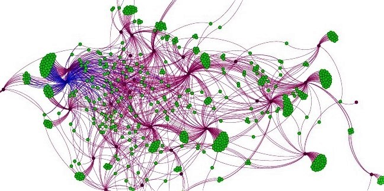

# Le syllabus

Ceci est mon cours de "data science", adapté à l'environnement r. On y trouvera les éléments des différents chapitres. L'ensemble des scripts (*.rmd) et des données(*.drs ou *.csv) sont inclus dans ce repository, sauf si le lien renvoie à un autre repository ( et on les retrouve dans ce dernier)

 * Chapître 1 : une présentation PPT d'introduction à l'[environnement r](https://docs.google.com/presentation/d/1FdAIW83N8EAWHCnc66PfnphdGyNr-wyS6dUPOlUTY0Hg/edit?usp=sharing)
 * Chapître 2 : [prise en main](https://github.com/BenaventC/Recommandation) avec un petit jeu de données et toute la panoplie des techniques de base.
 * Chapître 3 - [Dataviz avec ggplot](http://r.benavent.fr/graphMaj.html) : On apprend à y manipuler tidyverse et ggplot, c'est indispensable avant de regarder les modèles.
 * Chapître 4 - [Corrélations et régressions](http://r.benavent.fr/regression.html) reprendre les bases dans l'esprit de r et avec un peu de sophistication
 * Chapître 5 - [Analyse factorielle et clustering]() : pour revenir à la bonne époque de l'analyse de données
 * Chapître 6 - des [réseaux sociaux]() : on jouera avec l'API de twitter et l'idée de qui est proche de qui.
 * Chapître 7 - [Arbres de décisions et machine learning](http://r.benavent.fr/caret.html) on y verra comment une idée sexagénaire est devenue un modèle emblématique du machine learning. C'est plus que de la technique, mais de l'histoire des sciences
 * Chapître 8 - Un peu de NLP. On commencera par lire cette [synthèse](https://www.researchgate.net/publication/337744581_NLP_text_mining_V40_-_une_introduction_-_cours_programme_doctoral) et on jettera un coup d'oeil au projet [Polynésie](https://github.com/BenaventC/polynesie) ou à celui [AirBnb](https://github.com/BenaventC/AirbnbStudies)

## Les sets de données :

 * France allemagne 2002-2018 (extrait de l'ESS) : le fichier mastermoi.rds dans ce repository
 * 

## Book de référence
 * Pour le [rMarkdown](https://bookdown.org/yihui/rmarkdown/)
 * [Introduction à l’analyse d’enquêtes avec R et RStudio](https://larmarange.github.io/analyse-R/)
 * La rubrique [#culturedata](https://management-datascience.org/category/actualites/culture-data/) de Management et Data Science.
 * voir aussi les [ressources pour r](http://r.benavent.fr/Ressources.html)